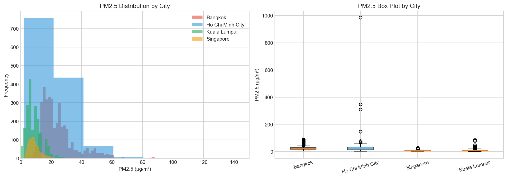
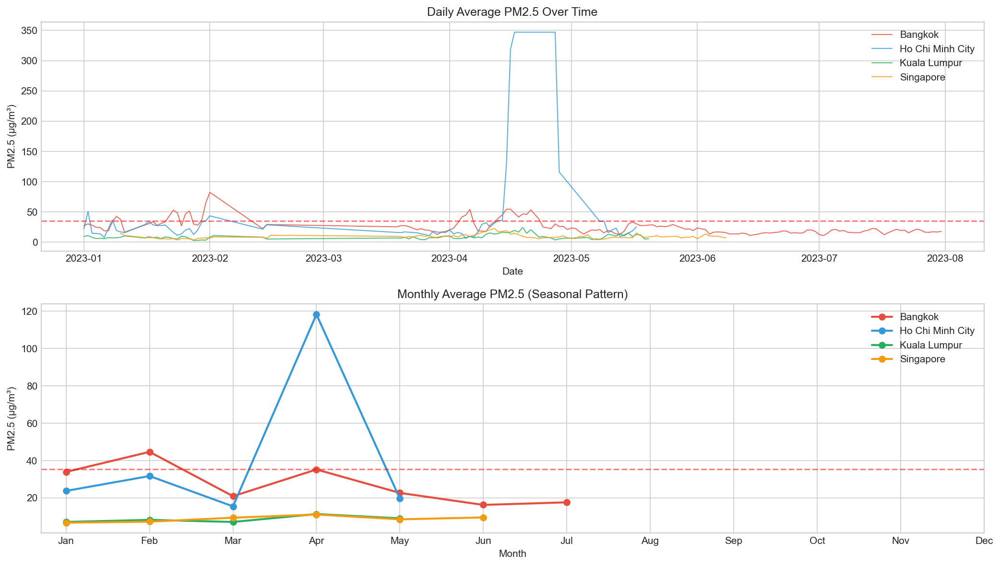
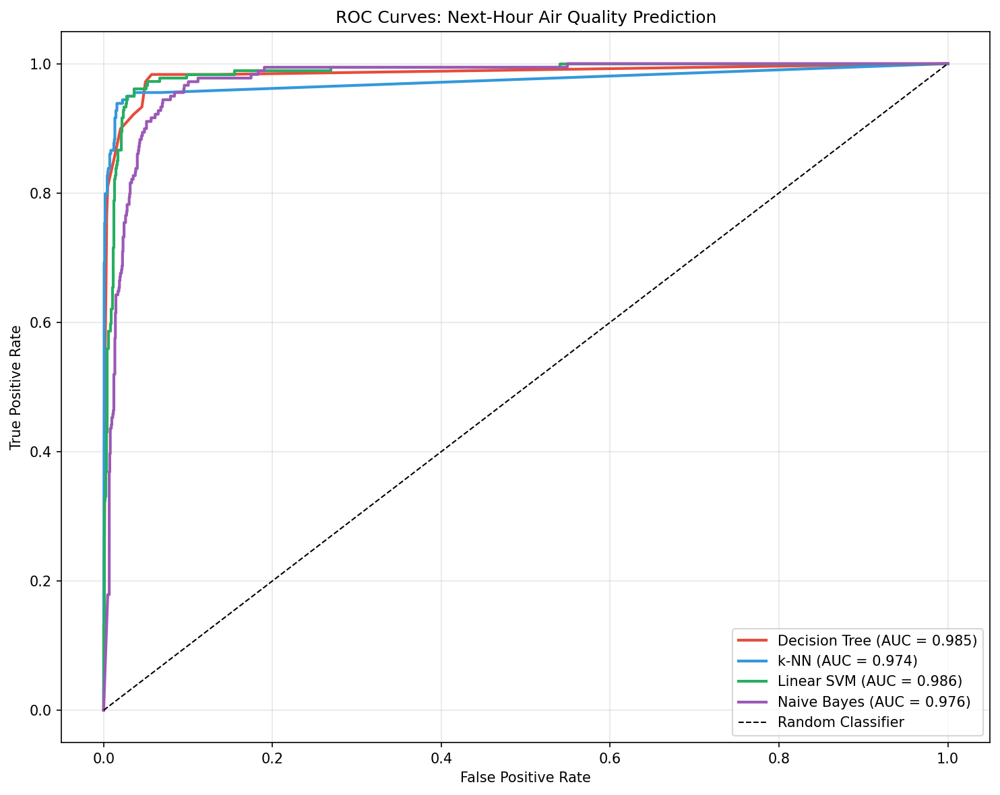
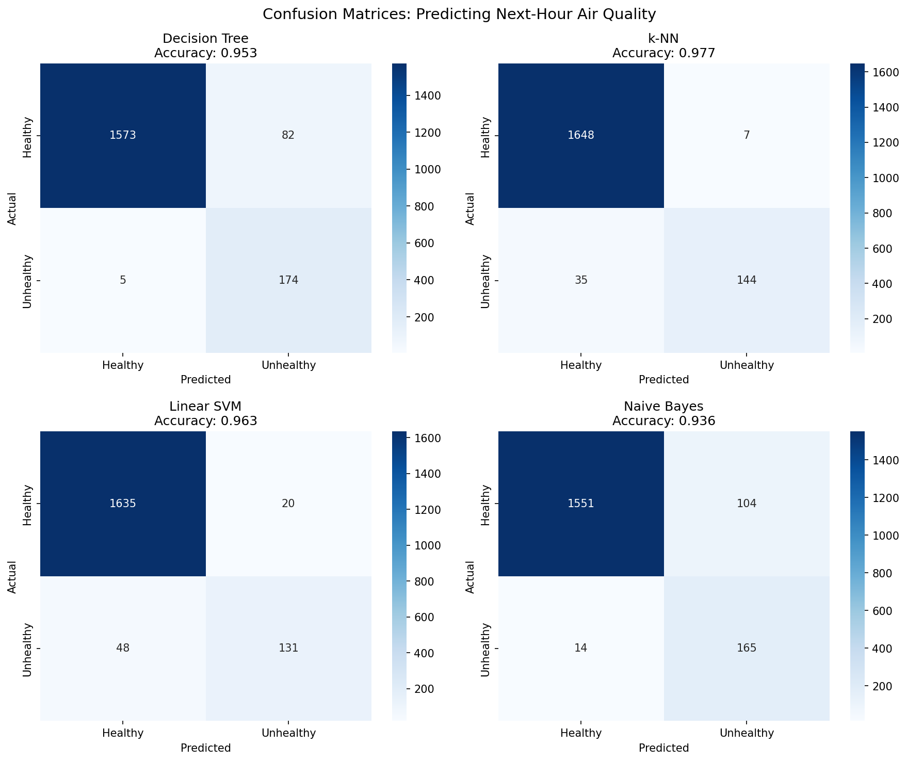
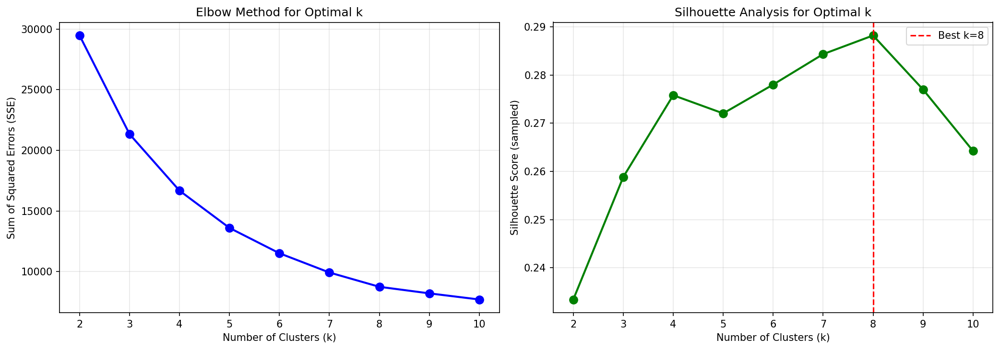
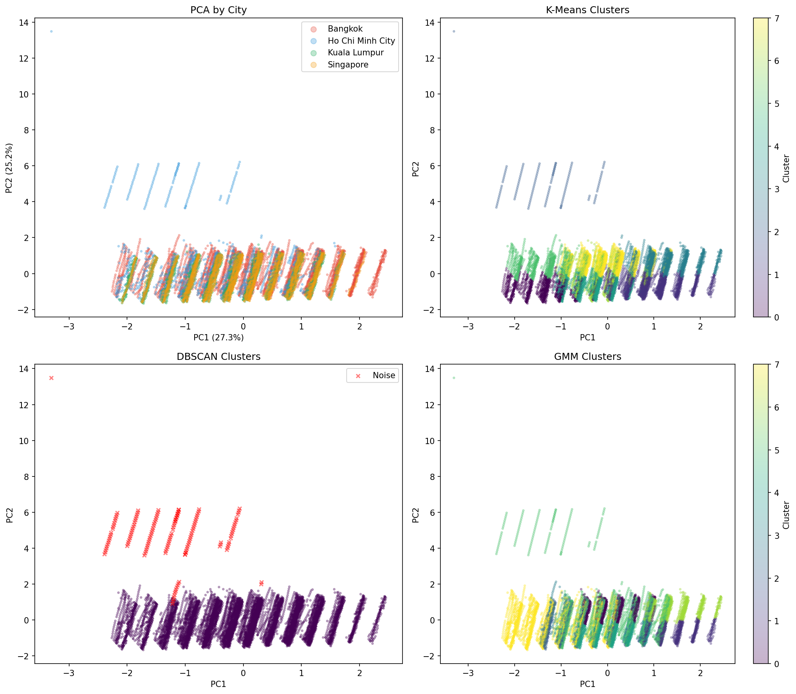
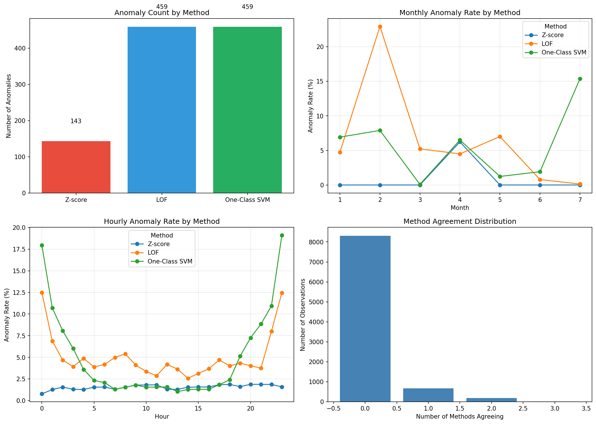
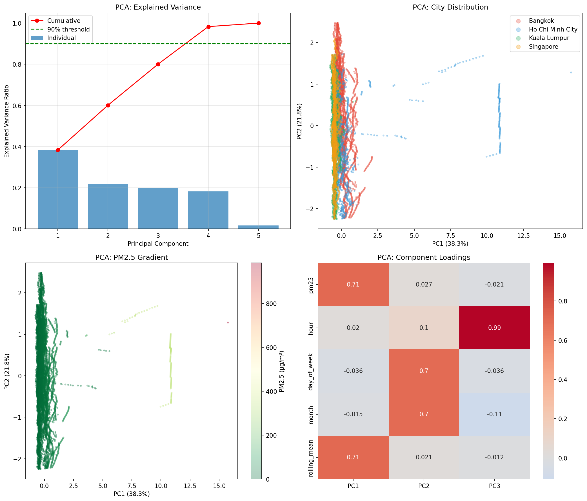
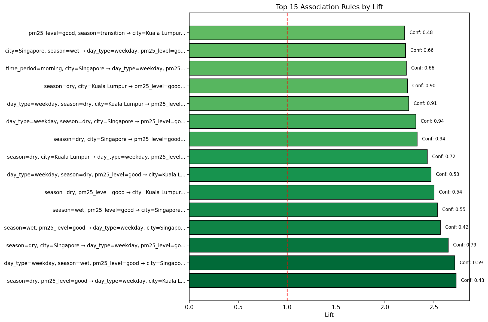

# Southeast Asia Air Quality Analysis

Analyze hourly PM2.5 data from Bangkok, Ho Chi Minh City, Kuala Lumpur, and Singapore (9,170 observations) to (1) forecast next-hour unhealthy air quality, (2) uncover pollution regimes via clustering, and (3) flag unusual pollution events via anomaly detection and interpret patterns with association rules.

**Tools:** Python, Pandas, NumPy, Scikit-learn, Matplotlib, Seaborn, SciPy, mlxtend
**Data:** OpenAQ API (Jan–Jul 2023; coverage varies by city)

## Problem Definition

**Unhealthy threshold:** PM2.5 > 35.4 µg/m³ (used as the project's "unhealthy" cutoff).

**Forecasting task:** Predict whether the next hour will be unhealthy using only past information:
- Lagged PM2.5 (1 hour, 24 hours)
- Rolling mean/std over the prior 24 hours (computed on shifted data)
- Temporal indicators (hour, day of week, month, weekend)
- City (one-hot encoded)

**Class imbalance:** 9,166 labeled samples after target shifting; ~9.7% unhealthy next-hour labels.

## Key Results

- **k-NN achieved 97.7% accuracy** for next-hour unhealthy prediction (F1 = 0.873). All classifiers achieved ROC-AUC ≥ 0.974.
- **Consensus anomaly rate** (flagged by ≥2 of Z-score, LOF, One-Class SVM) was 11.06% in Ho Chi Minh City vs 0.05% in Singapore (~220× difference).
- **K-Means selected k = 8** via silhouette analysis (silhouette ≈ 0.288), suggesting multiple recurring pollution regimes.
- **Association rules** show strong co-occurrence patterns linking "good" PM2.5 with Singapore/Kuala Lumpur and season/day-type categories.
  Example: `season=wet + pm25_level=good → city=Singapore` (lift ≈ 2.54).

## Visualizations

### Exploratory Data Analysis

PM2.5 levels vary dramatically across cities. Ho Chi Minh City shows the highest variability (SD ≈ 101.5 µg/m³) with extreme readings up to 985 µg/m³, while Singapore remains consistently low (max 27 µg/m³).



Daily and monthly averages (Jan–Jul 2023) highlight temporal variability and episodic spikes. The dashed red line marks the unhealthy threshold (35.4 µg/m³). Bangkok's monthly mean is highest in Feb, and Ho Chi Minh City shows a large spike in April driven by extreme readings.



> **Note:** "Season" labels are derived from month for downstream analysis: dry (Nov–Feb), transition (Mar–Apr), wet (May–Oct). In this dataset, the dry-season months present are primarily Jan–Feb.

### Classification: Next-Hour Air Quality Prediction

ROC curves show strong separability for all four classifiers (ROC-AUC ≥ 0.974). k-NN achieved the best F1 score (0.873), consistent with PM2.5's short-horizon persistence.



Confusion matrices illustrate the precision–recall tradeoff: the Decision Tree catches most unhealthy events (high recall) but raises more false alarms, while k-NN balances high precision with strong recall.



### Clustering: Identifying Pollution Regimes

Elbow + silhouette analysis selected k = 8 for K-Means, with diminishing returns beyond that point.



PCA projection of the clustering feature space is shown by city and by clustering assignments. DBSCAN flags "noise" points that sit away from the main mass of observations (often corresponding to extreme/unusual conditions), while K-Means and GMM partition broader regimes in the same PCA space.



### Anomaly Detection & PCA

Anomaly detection comparison across three methods:
- Z-score flags fewer points (most conservative)
- LOF and One-Class SVM flag more points (density/novelty-based)
- Monthly/hourly plots show when anomalies concentrate
- The agreement histogram shows how often methods overlap (consensus anomalies are defined as ≥2 methods agreeing)



PCA diagnostics:
- ~4 components are required to reach 90% explained variance
- PC1 is dominated by PM2.5 and rolling mean
- PC2 captures calendar timing (day of week + month)
- PC3 is primarily hour-of-day (diurnal timing)

The PM2.5 gradient plot highlights that extreme pollution values occupy distinct PCA regions.



### Association Rules: Condition–Pollution Patterns

Top association rules by lift. Many high-lift rules involve Singapore/Kuala Lumpur and pm25_level=good, reflecting consistent low PM2.5 in this dataset. Rules are associations (co-occurrence), not causal claims.



## Methods

| Task | Techniques |
|------|------------|
| Classification (next-hour unhealthy) | k-NN, Decision Tree, Linear SVM (calibrated), Naive Bayes |
| Clustering | K-Means, DBSCAN, Gaussian Mixture Model (GMM) |
| Anomaly Detection | Z-score, LOF, One-Class SVM (consensus ≥2) |
| Pattern Mining | Apriori association rules |
| Dimensionality Reduction | PCA |

## Quick Start

**1) Install dependencies**
```bash
pip install -r requirements.txt
```

**2) Run the full pipeline (recommended)**

*Option A — Re-download from OpenAQ (requires an API key):*
```bash
export OPENAQ_API_KEY="YOUR_KEY_HERE"
python scripts/run_all.py
```

*Option B — Use the bundled dataset (no API key):*

If you don't want to hit the API, run the analysis steps directly. Raw and processed CSVs are already included.
```bash
python scripts/preprocess.py
python scripts/eda.py
python scripts/classification.py
python scripts/clustering.py
python scripts/association.py
python scripts/anomaly_pca.py
```

**Outputs:**
- Figures are saved to `figures/`
- Processed data is saved to `data/processed/`

## Project Structure

```
data/raw/                        — raw OpenAQ exports per city
data/processed/combined_data.csv — cleaned + feature-engineered dataset
scripts/                         — pipeline scripts (download, preprocess, EDA, models)
figures/                         — generated PNGs used above
SEA_AQ_Report.pdf                — full write-up/report
```
